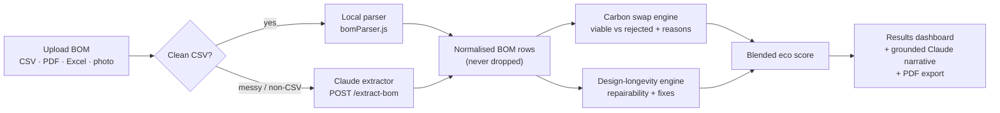
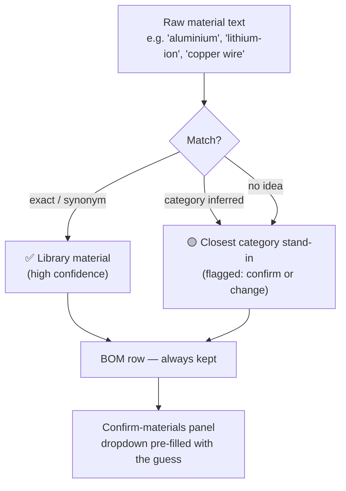
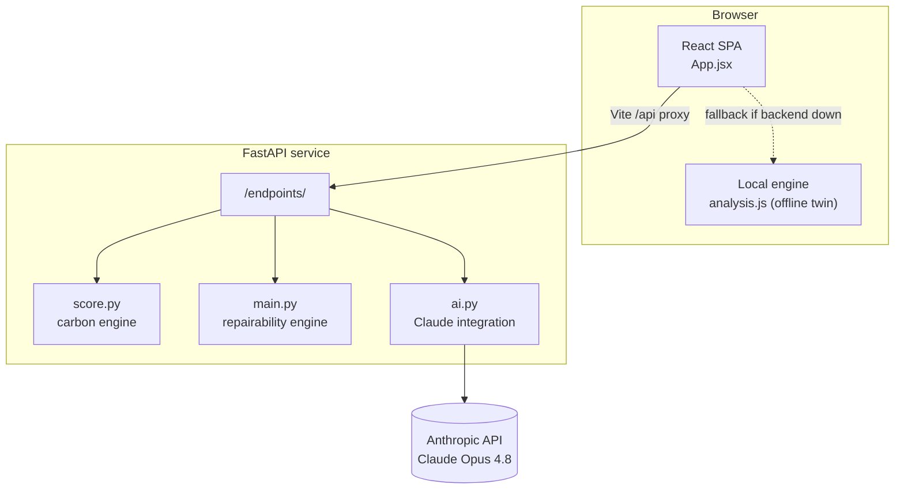

<div align="center">

# 🧭 ecocompass

### Score any build on carbon **and** repairability — and trust the number.

Drop in a bill of materials. ecocompass finds lower-carbon material swaps, **refuses the ones it can't justify (and tells you why)**, scores how repairable and long-lived the design is, and turns it all into a sourced, exportable report.

[](https://react.dev)
[](https://vitejs.dev)
[](https://fastapi.tiangolo.com)
[](https://www.anthropic.com)
[](LICENSE)

**Built for CSESoc Hackathon 2026** · sustainability track

</div>

---

## The problem

Product teams want to build greener, longer-lasting hardware — but the two questions that matter are painfully hard to answer up front:

1. **"What could this be made of instead?"** — every material swap trades carbon against cost, strength, temperature, recyclability. Most tools either hand-wave it or spit out a green number you can't audit.
2. **"Will anyone be able to repair it?"** — the single biggest lever on a product's lifetime footprint is whether a worn battery or cracked screen means a repair or a landfill. That never shows up in a carbon calculator.

ecocompass answers both from a single bill of materials — and every figure links back to its source, so you check the working, not just trust a number.

## What makes it different

> **It says no.** ecocompass will refuse a lower-carbon swap when the candidate fails a functional requirement — not enough tensile strength for a load-bearing frame, not food-safe for a part that needs to be, not rated for the service temperature. It shows you the tempting swaps it *rejected* and the exact reason each was cut. That honesty is the whole point: a sustainability tool you can put in front of an engineer.

- 🔬 **Sourced, not fabricated** — every material carries embodied-carbon, cost, strength, temperature and recyclability figures with a primary-source link and a note on how it was derived. The AI never invents numbers; it only explains ones the deterministic engines computed.
- ♻️ **Two engines, one score** — a **carbon swap engine** and a **design-longevity (repairability) engine** blend into one headline eco score.
- 🧠 **Reads anything** — a phone photo of a spec sheet, a scanned PDF, an Excel dump, or a messy CSV all become a structured BOM via Claude vision.
- 🛡️ **Never drops a row** — an unknown material or missing mass is never silently discarded. It's stood in with the closest match (flagged for you to confirm) so your totals stay honest.
- 📴 **Works offline** — the frontend ships a byte-identical local twin of the carbon engine, so the app keeps working even if the backend (or your Wi-Fi) is down.

---

## Features

| | Feature | What it does |
|---|---|---|
| 🧾 | **Universal BOM ingest** | Upload CSV, Excel, PDF, or an image. Clean CSVs parse instantly client-side; anything messy falls back to the Claude extractor. |
| 🔁 | **Justified swaps** | Ranks every viable lower-impact material per component and shows the rejected ones with the specific requirement each failed. |
| 🎚️ | **Carbon ↔ cost priority** | A live slider re-ranks every swap from cost-focused to carbon-focused in real time. |
| 🔧 | **Repairability score + fixes** | Grades how repairable the design is and lists concrete changes (fastening, sourcing, modularity) ranked by the points each recovers. |
| 📈 | **Scaled annual impact** | Multiplies per-unit CO₂e saved by your production volume into tonnes avoided per year. |
| 🕸️ | **Per-swap radar** | Compares original vs. suggested material across carbon, cost, durability and recyclability. |
| ✅ | **Confirm-and-correct panels** | Guessed materials and estimated masses surface in friendly panels with one-click accept or a dropdown override — the analysis updates instantly. |
| 📝 | **Grounded AI briefing** | Claude writes a plain-English summary using only the computed figures, including the honest "we refused this swap because…". |
| 📄 | **PDF report export** | One click produces a shareable, sourced eco report. |
| 📚 | **Material library browser** | Explore all 28 materials with full property data and sources, including bio-based recipes credited to the [Materiom](https://materiom.org) Commons. |

---

## How it works



**1 · Carbon swap engine** — for each line it derives the part's functional requirements (explicit, or inferred from the original material), splits the library into **viable** candidates (meet every requirement) and **rejected** ones (with the exact reason each failed), then ranks the viable pool by a carbon↔cost weighted score with a same-material / same-family affinity bonus. Each line gets a 🟢 / 🟡 / 🔴 verdict.

**2 · Design-longevity engine** — matches components and materials against a reference library (`data/*.csv` + `scoring_rules.json`) to score repairability from how parts are fastened and sourced, and emits ranked design fixes.

**3 · Blended score** — the headline eco score is a 50/50 blend of the carbon result and the repairability result, graded A–F.

**4 · AI layer (Claude Opus 4.8)** — `extract_bom` turns arbitrary files into structured rows and maps every material to the library; `generate_narrative` writes the briefing from the already-computed JSON, so it can explain but never fabricate.

### Robust ingestion — nothing gets silently lost

A messed-up CSV used to lose components: an unknown material was dropped and a missing mass became a flat `1 kg`. Now every row survives:



Missing masses are pre-filled with a Claude estimate (marked `EST`) that you accept with one click or edit — the carbon and cost totals always reflect a real number, and you always stay in control.

---

## Architecture



```
csesoc-hackathon-2026/
├── frontend/                     # React + Vite single-page app
│   ├── public/samples/           # demo BOM CSVs — good / mixed / bad
│   └── src/
│       ├── App.jsx               # all UI: upload, results, material library
│       ├── analysis.js           # carbon swap engine (local twin of score.py)
│       ├── bomParser.js          # CSV parsing + material resolver
│       ├── materials.js          # 28-material library + demo BOM
│       ├── pdfReport.js          # jsPDF report export
│       ├── api.js                # backend client (through /api proxy)
│       └── theme.css             # design tokens (warm paper + forest green)
└── backend/                      # FastAPI service
    ├── api/main.py               # HTTP endpoints + CORS + .env loading
    ├── main/
    │   ├── ai.py                 # Claude: extract_bom, narrative, resolver
    │   ├── score.py              # carbon swap engine (port of analysis.js)
    │   ├── main.py               # repairability / design-longevity engine
    │   └── parse.py              # CSV → rows
    ├── data/
    │   ├── material_library.csv  # material reference (aliases, repair notes…)
    │   ├── component_library.csv # component reference (failure risk, life…)
    │   └── scoring_rules.json    # repairability scoring rules
    └── requirements.txt
```

---

## Quickstart

### Prerequisites
- **Node.js 18+** and **Python 3.11+**
- An **Anthropic API key** for the AI features ([console.anthropic.com](https://console.anthropic.com) → API keys). *Optional* — the app runs fully on its local engine without one; only the file-extraction and narrative features need it.

### 1 · Backend (FastAPI)

```bash
cd backend
python -m venv .venv && source .venv/bin/activate      # Windows: .venv\Scripts\activate
pip install -r requirements.txt

cp .env.example .env                                    # then paste your key into .env
#   ANTHROPIC_API_KEY=sk-ant-...

python -m uvicorn api.main:app --reload --port 8000
```

Health check: <http://localhost:8000/> → `{"service":"ecocompass","status":"ok","ai":true,…}`

### 2 · Frontend (React + Vite)

```bash
cd frontend
npm install
npm run dev
```

Open <http://localhost:5173>. Vite proxies `/api` → `http://localhost:8000`, so the two talk to each other with no extra config.

> **No key? No problem.** Click **Analyze sample BOM**, or the **Clean / Mixed / Messy** sample chips, to explore the whole experience on bundled data with zero setup.

---

## API reference

Base URL `http://localhost:8000`. The frontend reaches these through the `/api` proxy.

| Method | Endpoint | Purpose |
|---|---|---|
| `GET`  | `/` | Health check + endpoint index (`ai: true/false`). |
| `POST` | `/extract-bom` | File (image / PDF / Excel / CSV) → structured BOM rows, via Claude. Never drops a row. |
| `POST` | `/analyze-bom` | BOM + weights → per-line swap analysis, repairability, and blended score. |
| `POST` | `/narrative` | A computed analysis → grounded plain-English briefing (Claude). |
| `POST` | `/library-compare` | BOM → matches against the reference library (failure risk, service life, recycling). |
| `POST` | `/upload-csv` | Raw CSV → parsed rows (utility endpoint). |

<details>
<summary>Example — extract a messy CSV</summary>

```bash
curl -X POST http://localhost:8000/extract-bom -F "file=@messy.csv"
```
```jsonc
{
  "rows": [
    { "component": "Battery", "from": "ABS", "kg": 0.34,
      "materialConfidence": "proxy", "materialRaw": "lithium-ion",
      "materialReason": "\"lithium-ion\" isn't in the swap library — using ABS as a placeholder. Confirm or pick a better fit." },
    { "component": "Rear casing", "from": "aluminum_6061", "kg": 0.15,
      "kgMissing": true, "kgEstimated": true }
  ],
  "warnings": ["1 material wasn't in the swap library — we filled in the closest match for you to confirm below."],
  "meta": { "productName": "Electronic Device", "componentCount": 2, "totalKg": 0.49 }
}
```
</details>

---

## Data & provenance

- **28-material swap library** spanning metals, plastics, wood, bioplastics and composites — including **10 bio-based recipe families credited to the [Materiom](https://materiom.org) Commons**. Each entry carries embodied carbon, cost, tensile strength, service temperature, recyclability, durability and outdoor/food ratings, with a primary-source URL and a derivation note.
- **Reference libraries** (`backend/data/`) drive repairability: `material_library.csv` and `component_library.csv` (with aliases, failure risk, service life, repair notes) and `scoring_rules.json`.
- Figures are transparent estimates — Materiom-derived numbers are explicitly marked *indicative*. Nothing is presented as more certain than it is.

## Tech stack

| Layer | Tools |
|---|---|
| **Frontend** | React 18, Vite 5, Recharts 3 (radar), jsPDF (report export), hand-rolled design system |
| **Backend** | FastAPI, Uvicorn, python-multipart, openpyxl (Excel), python-dotenv |
| **AI** | Anthropic Python SDK · Claude Opus 4.8 (vision extraction + grounded narrative, with prompt caching) |
| **Data** | Curated CSV/JSON libraries; Materiom Commons for bio-based materials |

---

## Screenshots

> The screenshots below live in [`docs/screenshots/`](docs/screenshots) — see that folder's README for the exact three shots to drop in.

| Landing | Results dashboard | Confirm-and-correct |
|---|---|---|
|  |  |  |

---

## Roadmap

- [ ] Persist analyses and share via link
- [ ] Expand the swap library into electronics (battery chemistries, PCBs, glass) so more components get real swaps rather than placeholders
- [ ] Wire the "not-analysed" out-of-scope parts into a mass-only accounting lane
- [ ] Regional carbon-intensity factors for manufacturing energy
- [ ] Batch / multi-product portfolio view

## Team

Built at **CSESoc Hackathon 2026** by:

- **Cathlyn Widjaja** ([@cw-lynne](https://github.com/cw-lynne)) — backend: FastAPI service, CSV pipeline, reference libraries
- **Donald Chung** — frontend, the carbon + repairability engines, and the Claude AI integration

## Credits

- [Materiom](https://materiom.org) — open recipes for bio-based materials
- Embodied-carbon figures informed by the ICE database and cited LCA literature (see each material's `source_note`)
- AI features powered by [Anthropic Claude](https://www.anthropic.com)

## License

[MIT](LICENSE) © 2026 the ecocompass team
